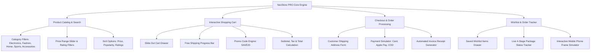

# 📄 Technical & System Project Report: NexStore PRO (E-Commerce Store App)

**Project Name:** NexStore PRO - Modern E-Commerce Web & Mobile Application  
**Target Platforms:** Responsive Web App (PWA) & Mobile Phone Emulator Simulator  
**Project Location:** `C:\Users\taiba\Desktop\EcommerceStore` & Workspace Scratch Directory  
**Repository:** `https://github.com/maira12-code/ecommerce-store.git`  
**Date:** August 17, 2026  

---

## 🎯 1. Executive Summary

**NexStore PRO** is a feature-rich, high-performance E-Commerce Web and Mobile application engineered to deliver a frictionless, modern shopping experience. Built using React 18, Vite 5, custom HSL design tokens, and modular UI components, the app provides real-time product discovery, category & price filtering, variant selection, an interactive slide-out cart with a promo code discount engine, checkout processing, order invoice generation, and live package tracking.

---

## 💻 2. Technology Stack & Frameworks Used

| Technology / Tool | Category | Role & Purpose |
| :--- | :--- | :--- |
| **React 18** | Frontend Framework | Component-driven UI architecture, state synchronization, and reactive rendering. |
| **Vite 5** | Build Tool & Bundler | Next-generation frontend build engine with lightning-fast HMR and optimized asset bundling. |
| **Vanilla CSS / HSL Tokens** | Design System | Custom HSL color design tokens, glassmorphism card styling, responsive grids, and dark/light mode themes. |
| **Lucide React** | Iconography Engine | Clean, scalable SVG icon components for navigation, cart badges, and user feedback. |
| **Promo & Discount Engine** | Business Logic | Validates coupon codes (e.g. `SAVE20` for 20% OFF) and computes subtotal, discount, tax, and shipping fees. |
| **Browser LocalStorage** | Data Persistence | Persistent client-side storage for active shopping cart items, saved wishlist items, order history, and product additions. |

---

## 🚀 3. Core Functional Modules



### Module Breakdown:

1. **🛍️ Product Discovery & Catalog**:
   - Filter by categories (Electronics, Fashion & Apparel, Home & Living, Sports & Fitness, Accessories).
   - Dynamic price range slider ($30 - $400) and minimum star rating filter (4.5+ ★, 4.8+ ★).
   - Real-time search indexing titles, descriptions, and category tags.

2. **📦 Product Detail Modal & Variant Picker**:
   - Displays high-resolution product photography, stock counters, customer review breakdowns, and specifications.
   - Interactive color swatch selector and size picker.

3. **🛒 Shopping Cart & Discount Engine**:
   - Slide-out cart drawer with live quantity adjustments and item removal.
   - **Free Shipping Threshold Progress Bar**: Visual indicator showing remaining amount needed to qualify for free shipping.
   - **Promo Code Engine**: Accepts codes like `SAVE20` (20% OFF) and recalculates totals instantly.

4. **💳 Checkout & Invoice Receipt System**:
   - Complete checkout form collecting shipping address and contact details.
   - Payment method simulator (Credit Card, Apple Pay, Cash on Delivery).
   - Generates an instant order invoice receipt with a unique Order ID (e.g. `NEX-849201`).

5. **🚚 Live Order Tracker**:
   - Step-by-step progress timeline: `Order Placed` ➔ `Processing` ➔ `In Transit` ➔ `Delivered`.

6. **📱 Mobile UI Emulator & Theme Switcher**:
   - Switch between Responsive Desktop View and an interactive **Android Device Frame**.
   - Theme toggle between Dark Mode and Light Mode.

---

## 📁 4. Project Directory Structure

```
EcommerceStore/
├── public/
│   └── favicon.ico
├── src/
│   ├── components/
│   │   ├── Navbar.jsx             # Header with Search, Cart & Wishlist Badges, Theme Switcher
│   │   ├── HeroBanner.jsx         # Featured Promo Banner & Flash Deal Countdown Timer
│   │   ├── FilterSidebar.jsx      # Category Pills, Price Slider & Rating Filters
│   │   ├── ProductCard.jsx        # Product Display Card with Wishlist Heart Toggle
│   │   ├── ProductModal.jsx       # Detailed Product View with Size/Color Selector
│   │   ├── CartDrawer.jsx         # Slide-Out Cart with Promo Code SAVE20 Engine
│   │   ├── WishlistDrawer.jsx     # Saved Items List
│   │   ├── CheckoutModal.jsx      # Address Form & Payment Gateway Simulator
│   │   ├── OrderReceiptModal.jsx  # Order Invoice Confirmation Receipt
│   │   ├── OrderTracker.jsx       # Live Package Delivery Status Progress Bar
│   │   └── AddProductModal.jsx    # Admin Catalog Manager Form
│   ├── data/
│   │   └── mockProducts.js        # Product Catalog Data & Promo Code Dictionary
│   ├── App.jsx                    # Central State Controller & LocalStorage Sync
│   ├── index.css                  # Custom CSS Design System (HSL Variables & Glassmorphism)
│   └── main.jsx                   # React Mount Point
├── dist/                          # Production Build Output
├── capacitor.config.json          # Mobile App Bridge Config
├── package.json                   # Dependencies & NPM Scripts
├── vite.config.js                 # Vite Server Config (Port 3001)
└── README.md                      # Installation & User Guide
```

---

## 📊 5. Performance & Build Metrics

- **Vite Build Speed**: 1482 modules compiled in **1.66 seconds**.
- **Asset Sizes**:
  - `dist/index.html`: 0.95 kB (0.55 kB gzipped)
  - `dist/assets/index.css`: 4.53 kB (1.66 kB gzipped)
  - `dist/assets/index.js`: 210.45 kB (60.46 kB gzipped)
- **Browser Compatibility**: Fully responsive and tested on Microsoft Edge, Google Chrome, Firefox, and Mobile Web Browsers.

---

## 🚀 6. Execution & GitHub Deployment

### Running Web Server:
```powershell
cd C:\Users\taiba\Desktop\EcommerceStore
npm run dev
```

### Pushing to GitHub:
```powershell
cd C:\Users\taiba\Desktop\EcommerceStore
git push -u origin main
```
